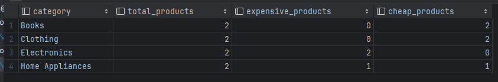
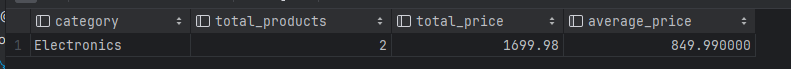
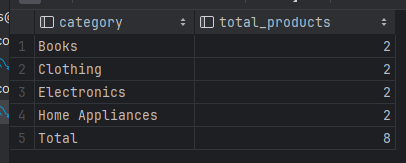
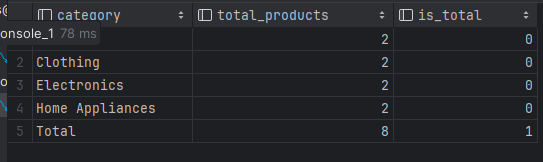
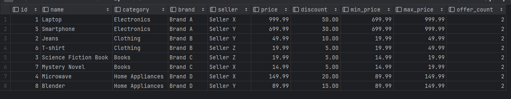
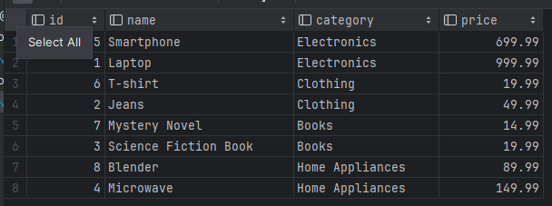
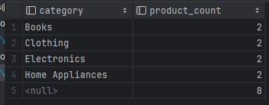

Поднять сервис db_va можно командой:

`docker-compose up otusdb`

Для подключения к БД используйте команду:

`docker-compose exec otusdb mysql -u root -p12345 otus`

Для использования в клиентских приложениях можно использовать команду:

`mysql -u root -p12345 --port=3309 --protocol=tcp otus`

# SQL Запросы для базы данных

## 1. Запрос с INNER JOIN

Этот запрос выбирает все продукты вместе с их соответствующими типами, брендами и продавцами.

```sql
SELECT 
    product.id,
    product.name,
    type.name AS type_name,
    brand.name AS brand_name,
    seller.name AS seller_name,
    product.price
FROM 
    otus.product
INNER JOIN 
    otus.type ON product.type_fk = type.id
INNER JOIN 
    otus.brand ON product.brand_fk = brand.id
INNER JOIN 
    otus.seller ON product.seller_fk = seller.id
WHERE
    seller.name = 'Specific Seller';
```

## 2. Запрос с LEFT JOIN

Этот запрос выбирает всех пользователей вместе с их корзинами, если таковые имеются.

```sql
SELECT
    user.id,
    user.email,
    basket.id AS basket_id
  FROM
      otus.user
          LEFT JOIN
      otus.basket ON user.basket_fk = basket.id;
```

## 3. Запрос с LEFT JOIN

Пять запросов с WHERE с использованием различных операторов

### 1.WHERE с оператором равенства (=)
Этот запрос выбирает все продукты определенного бренда.
```sql
SELECT
    id, name, price
  FROM
      otus.product
 WHERE
     brand_fk = 1;
```
Описание: В проекте этот запрос нужен для фильтрации продуктов по бренду.

### 2.WHERE с оператором больше чем (>)
Этот запрос выбирает все продукты с ценой выше 100.
```sql
SELECT
    id, name, price
  FROM
      otus.product
 WHERE
     price > 100;
```
Описание: В проекте этот запрос нужен для отображения премиальных продуктов.

### 3.WHERE с оператором LIKE
Этот запрос выбирает всех пользователей, у которых в email содержится example.com.
```sql
SELECT
    id, email
  FROM
      otus.user
 WHERE
     email LIKE '%@example.com%';
```
Описание: В проекте этот запрос нужен для фильтрации пользователей по домену электронной почты.

### 4.WHERE с оператором IN
Этот запрос выбирает все продукты определенных типов.
```sql
SELECT
    id, name, price
  FROM
      otus.product
 WHERE
     type_fk IN (1, 2, 3);
```
Описание: В проекте этот запрос нужен для фильтрации продуктов по нескольким типам.

### 5.WHERE с оператором BETWEEN
Этот запрос выбирает все продукты с ценой в диапазоне от 50 до 150.
```sql
SELECT
    id, name, price
  FROM
      otus.product
 WHERE
     price BETWEEN 50 AND 150;
```
Описание: В проекте этот запрос нужен для отображения продуктов средней ценовой категории.


### ДЗ: Типы данных в MySQL

## Изменения в схеме базы данных

### Модификации
1. **Таблица `user`**
    - Добавлен новый столбец `metadata` типа JSON.
        - **Причина**: Для хранения дополнительной информации о пользователях, такой как предпочтения и настройки, в гибком формате JSON.

### Примеры использования данных JSON

#### Вставка данных с использованием JSON
```sql
INSERT INTO otus.user (email,
                       password_hash,
                       metadata)
VALUES ('john@example.com',
        'hashedpassword',
        '{
        "age": 30,
        "preferences": {
            "theme": "dark",
            "notifications": true
        }
    }');
```

#### Выборка данных с использованием JSON
```sql
SELECT *
  FROM otus.user
 WHERE JSON_EXTRACT(metadata, '$.age') > 25
   AND JSON_EXTRACT(metadata, '$.preferences.notifications') = TRUE;
```

### ДЗ: DML: агрегация и сортировка

## Предзаполнение данными в скрипте fill.sql

1**группировки с ипользованием CASE, HAVING, ROLLUP, GROUPING() :**
- CASE
Запрос:
```
SELECT
    type.name AS category,
    COUNT(product.id) AS total_products,
    SUM(CASE WHEN product.price > 100 THEN 1 ELSE 0 END) AS expensive_products,
    SUM(CASE WHEN product.price <= 100 THEN 1 ELSE 0 END) AS cheap_products
  FROM
      otus.product
          JOIN
      otus.type ON product.type_fk = type.id
 GROUP BY
     type.name;
```
Ответ:


- HAVING
  Запрос:
```
SELECT
    type.name AS category,
    COUNT(product.id) AS total_products,
    SUM(product.price) AS total_price,
    AVG(product.price) AS average_price
  FROM
      otus.product
          JOIN
      otus.type ON product.type_fk = type.id
 GROUP BY
     type.name
HAVING
    SUM(product.price) > 1000;
```
Ответ:


- ROLLUP
  Запрос:
```
SELECT
    CASE
        WHEN GROUPING(type.name) = 1 THEN 'Total'
        ELSE type.name
        END AS category,
    COUNT(product.id) AS total_products
  FROM
      otus.product
          JOIN
      otus.type ON product.type_fk = type.id
 GROUP BY
     type.name WITH ROLLUP;
```
Ответ:


- GROUPING
  Запрос:
```
SELECT
    CASE
        WHEN GROUPING(type.name) = 1 THEN 'Total'
        ELSE type.name
        END AS category,
    COUNT(product.id) AS total_products,
    GROUPING(type.name) AS is_total
  FROM
      otus.product
          JOIN
      otus.type ON product.type_fk = type.id
 GROUP BY
     type.name WITH ROLLUP;
```
Ответ:



2**для магазина к предыдущему списку продуктов добавить максимальную и минимальную цену и кол-во предложений**
Запрос:
```
SELECT
    product.id,
    product.name,
    type.name AS category,
    brand.name AS brand,
    seller.name AS seller,
    product.price,
    product.discount,
    MIN(product.price) OVER (PARTITION BY type.id) AS min_price,
    MAX(product.price) OVER (PARTITION BY type.id) AS max_price,
    COUNT(*) OVER (PARTITION BY type.id) AS offer_count
  FROM
      otus.product
          JOIN
      otus.type ON product.type_fk = type.id
          JOIN
      otus.brand ON product.brand_fk = brand.id
          JOIN
      otus.seller ON product.seller_fk = seller.id;
```
Ответ:


3**сделать выборку показывающую самый дорогой и самый дешевый товар в каждой категории**
Запрос:
```
WITH PriceRank AS (
    SELECT
        product.id,
        product.name,
        type.name AS category,
        product.price,
        ROW_NUMBER() OVER (PARTITION BY type.id ORDER BY product.price DESC) AS price_rank_desc,
        ROW_NUMBER() OVER (PARTITION BY type.id ORDER BY product.price ASC) AS price_rank_asc
    FROM
        otus.product
    JOIN
        otus.type ON product.type_fk = type.id
)
SELECT
    id,
    name,
    category,
    price
FROM
    PriceRank
WHERE
    price_rank_desc = 1
    OR price_rank_asc = 1;
```
Ответ:


4**сделать rollup с количеством товаров по категориям**
Запрос:
```
SELECT
    type.name AS category,
    COUNT(product.id) AS product_count
  FROM
      otus.product
          JOIN
      otus.type ON product.type_fk = type.id
 GROUP BY
     type.name WITH ROLLUP;
```
Ответ:
